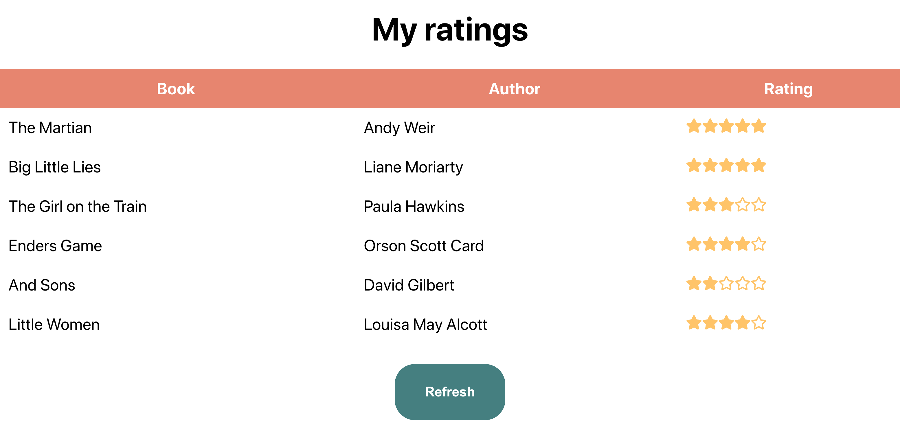

# HarperDB + React Review App

[](https://app.netlify.com/sites/book-rating-demo/deploys)

This is a demo of React and HarperDB, showing some ratings for books. You might disagree with my ratings but you'll have to fight me on them some other time. Run `yarn start` after cloning and installing to get it going!

Or, if you'd like to deploy this yourself to [Netlify](https://url.netlify.com/Bk4UicocL), click this button and it will clone it and deploy it. You'll need to complete the HarperDB setup to make it work properly!

[](https://app.netlify.com/start/deploy?repository=https://github.com/cassidoo/book-rating-demo&utm_source=github&utm_medium=reactharperdb-cs&utm_campaign=devex)

## HarperDB setup

You'll need to put in your **Instance URL** and **user** and **password** into the Provider in index.js to make this work. Make a `.env` file and populate it like so:

```
REACT_APP_DB_URL=https://{your stuff here}.harperdbcloud.com
REACT_APP_USER={your name here}
REACT_APP_PASSWORD={your password here}
```

In the demo I did live with this project, I hardcoded these values in, and you can too! You can check out the git history to see how. Those credentials don't work anymore though, so don't try them. 😉

If you'd like to populate your table with data, here is an example query:

```sql
INSERT INTO reviews.books (bookid, name, author, review)
   VALUES(1, 'The Martian', 'Andy Weir', 5), (2, 'Big Little Lies', 'Liane Moriarty', 5), (3, 'The Girl on the Train', 'Paula Hawkins', 3)
```

The application should generally look like this out of the box when working properly:


